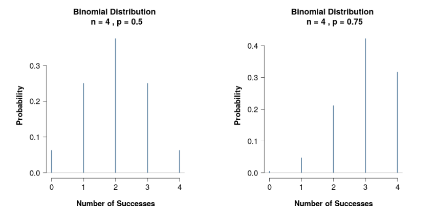
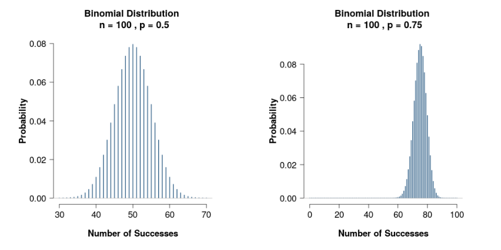
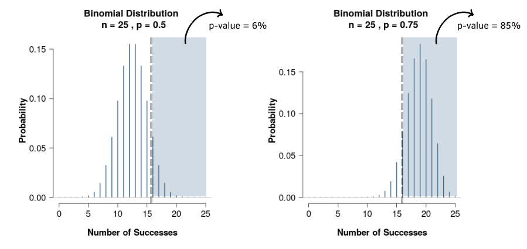

# Heads and tails cheater finder 🕵🏽‍♀️🪙

## 1. Introduction
This program allows to use a statistical method to catch an unfair player in Heads and Tails game.

Coin flipping, coin tossing, or heads or tails is the practice of throwing a coin in the air and checking which side is showing when it lands, in order to choose between two alternatives, heads or tails, sometimes used to resolve a dispute between two parties. It is a form of sortition which inherently has two possible outcomes. The party who calls the side that is facing up when the coin lands wins. ([Wikipedia.org](https://en.wikipedia.org/wiki/Coin_flipping), 2023)

This project is inspired by these video and game from Primer:

- [How To Catch A Cheater With Math](https://www.youtube.com/watch?v=XTcP4oo4JI4)
- [Catch the cheaters game](https://primerlearning.org/)

This program has 3 differents modes:
1. In live mode: allows to enter game results on the go to classify a player as fair or unfair player.

2. CSV mode : allows to enter a cvs file name with several players and their results. Each player from csv file is classified as fair or unfair player.

3. Scenarios generator: allows user to create a population with m fair players and n unfair players. Generates a csv file with the generated population.

This program has also a parameters option that allows user to modify test parameters. These parameters allows to set test to satisfy following questions:

1. What is the unfair face? ('H' for head or 'T' for tail)
2. What is the unfair face probalility for an unfair coin?
3. From a population, how many (%) fair players do we accept to wrongly accuse? (False positive rate)
4. From this same population, how many (%) unfair players do we want to catch? (True positive rate)

## 2. Binomial distribution and Frequentist hypothesis testing

- #### Binomial distribution

When flipping a fair coin we have two possible landing faces: head or tail. The probability of get a face (head or tail) for each flip is the same from trial to trial, in other words each flip is independent from previous flips. This kind of phenomenon is described by a binomial distribution.

For example, for three flips of coin we can get any of the following outcomes:

|Outcome|First flip|Second flip|Third flip|
|----------|-------------|-------------|-------------|
|1|Tail|Tail|Tail|
|2|Head|Tail|Tail|
|3|Tail|Head|Tail|
|4|Tail|Tail|Head|
|5|Tail|Head|Head|
|6|Head|Tail|Head|
|7|Head|Head|Tail|
|8|Head|Head|Head|

There is eight possibles results for flipping a coin three times. We can now calculates probabilities of getting a specified number of "Heads" in an outcome:

|Number of "Heads"|Probability|
|-----------------|-----------|
|0|1/8 = 12,5%|
|1|3/8 = 37,5%|
|2|3/8 = 37,5%|
|3|1/8 = 12,5%|

These same results can be obtained using binomial distribution function, defined as follows:

$$
P(h,n,p) = {n \choose h}p^h(1-p)^{n-h} = \frac{n!}{h!(n-h)!}p^h(1-p)^{n-h}
$$

Where h is the number of successes in n trials and p is the probability of success on a single event. So we can rewrite the above table as it follows:

|Number of "Heads"|Probability|
|-----------------|-----------|
|0|$P(0,3,0.5)$|
|1|$P(1,3,0.5)$|
|2|$P(2,3,0.5)$|
|3|$P(3,3,0.5)$|

- #### Frequentist hypothesis testing

To identify a player as fair or unfair player we will use frequentist hypothesis testing. This test will make it possible to say how unusual is a player result under a given hypothesis.

- **Test statistic:** quantity, calculated from dataset to distinguish null and alternative hypothesis.

- **p-value:** the probability of obtaining test results at least as extreme as the result actually observed, under the assumption that the null hypothesis is correct.

In parameters we ask user for two important questions (questions 3 and 4) that allows to define a test statistic that can answer both questions at the same time.

1. Hypothesis test for answer question 3 : From a population, how many (%) fair players do we accept to wrongly accuse?

$H_0:\ This\ is\ a\ fair\ player$

$H_1:\ This\ is\ an\ unfair\ player$

$p-value = \% wrongly\ acused\ fair\ players\ tolerance$

2. Hypothesis test for answer question 3 : From this same population, how many (%) unfair players do we want to catch?

$H_0:\ This\ is\ an\ unfair\ player$

$H_1:\ This\ is\ a\ fair\ player$

$p-value = \% unfair\ players\ do\ we\ want\ to\ catch$

Let's look to binomial distribution of fair and unfair coins if we flip the coin 4 times :

As we can see, probability distribution for an unfair coin is a little shifted to right. This is because with an unfair coin, the chances of getting one of the faces more often are higher. This shift gets bigger when we flip the coin more and more times, for instance, with 100 flips we get:

More we flip the coin, bigger unfair coin binomial distribution curve is shifted and easier we can identify fair and unfair players. Althought, we want our test to be as brief as possible, it is, to take just the minimal necessary number of flips to identify fair and unfair players. So an optimal number of flips is to be found to satisfy both questions 3 and 4 from parameters.

For instance, if we want to design a test that could catch 85% of unfair players wrongly accusing just 6% of fair players and assuming a success probability of an unfair coin to be 75% we get a minimal of 25 flips and a test statistic of 16. It is that a player who gets 16 times or more the same face in 25 flips is suspect to be an unfair player.

These thresholds can be found by iterations. For a fix h, the bigger n is, smaller p-value gets for a fair coin and the bigger p-value gets for an unfair coin.

Heads and tails cheaters finder program allows to find appropriate test parameters and apply then to a player or a population of players.

## 3. Program functions

### 3.1 Parameters functions

These functions allows to create, update and get parameters from a '.ini' file that stores all program parameters.

**create_parameters( ):** This functions creates a configuration file to save all needed parameters. Is called in get_parameter when a 'parameters.ini' file is not found.
Default parameters and in file parameters name are :

- Fair coin probability ("p_fair"): 50%
- Unfair coin probability ("p_unfair"): 75%
- False positive rate ("false_positive_rate"): 5%
- True positive rate ("true_positive_rate"): 80%
- Supposed unfair face ("face"): 'H'

**update_parameters( ):**     This function calls SelectionMenu()object that allows to update a parameter from configuration file. Is called by user in main menu.

**get_parameter(*param*):**     This function get a parameter from 'parameters.ini' file. Calls *create_parameters( )* if an 'parameters.ini' file is not found.
- param param: parameter to get
    - type param: str
- return: a parameter readed from 'parameters.ini'
    - rtype: str

### 3.2 Test functions

**binomial_distribution(*n, h, p*):** Calculates probability of *h* successes in *n* individual experiments using the binomial distribution.

- param n: number of individual experiments
    - type n: int
- param h: number of successes
    - type h: int
- param p: success probability for a single observation
    - type p: float
- return: probability of h successes in n individual experiments
    - rtype: float

**test_rule(*p_fair, p_unfair, fp_rate, tp_rate*):** Calculates the minimun experiments number and the minimun success observation needed to accuse a player of cheating (test statistic).
For a fixed n, the higher h is, the less fair players are wrongly accused and the less unfair players are catched. An couple of n and h need to be found to satisfy user criteria.

- param *p_fair*: probability of success (head or tail) with a fair coin
    - type *p_fair*: float
- param p_unfair: probability of success (head or tail) with an unfair coin
    - type *p_unfair*: float
- param *fp_rate*: false positive rate, how many fair players we accept to wrongly accuse ?
    - type fp_rate: float
- param *tp_rate*: true positive rate, how many unfair player do we want to catch ?
    - type *tp_rate*: float
- return: minimun experiments number and the minimun success observation needed to accuse a player of cheating
    - rtype: tupple

**is_cheater(*results, face, n, h*):** Hypothesis testing: use teest statistic obtained from **test_rule** function to determine if a player is actually a unfair player or not based on their results.

- param results: a list with each plays result
    - type results: list
- param *n*: number of individual experiments needed to satisfy user criteria
    - type *n*: int
- param h: number of successes needed to accuse a player
    - type *h*: int
- param *face*: face supposed to land often
    - type *face*: str
- raise: *ValueError* when number of results in results list in less than *n*
- return:
    - "fair player" if number of successes in *results* is smaller than *h*
    - "unfair player" if number of successes in *results* is bigger than *h*
    - "test cannot be applied" if numver of flips in *results* is smaller than *n*
    - rtype: str

### 3.3 In live mode

**get_results(*n*):** Ask for *n* flip results and only accepts 'h' or 't' case insensitive.
- param n: minimun observations needed
    - type n: int
- return: a list with all flips results when user enter all needed observations
    - rtype: list

### 3.4 CSV mode and scenarios generator functions

**csv_mode(*file, face, n, h*):** This function read a generated scenario with players results and write a new csv file with players results on hypothesis test. At the end print population class that sums all population properties up.
Input csv file fieldnames are : 'player;results;true_label'
Output csv file fieldnames are : 'player;results;true_label;test_label'

- param file: csv file name with players results
    - type file: str
- param face: face supposed to land often
    - type face: str
- param n: number of individual experiments
    - type n: int
- param h: number of successes
    - type h: int

### 3.5 Main menu function

**results_gen(*p, face, n*):** This function creates scenarios for a player (flips results) with a given probability weight for each face. Uses python random module choices function to generate pseudo-random results for a coin flip.
- param p: probability of getting "face" in a flip
    - type p: float
- param face: supposed unfair face
    - type face: str
- param n: number of flips to simulate
    - type n: int
- return: a list with player results, 'H' for head and 'T' for tail
    - rtype: list

**csv_gen(*f, u, p_unfair, face, n*):** This function generates an csv with 'f' fair players and 'u' unfair players and their results.
Uses random module sample function to randomize fair and unfair players sequence in csv file output.

- param f: number of fair players to simulate
    - type f: int
- param u: number of unfair players to simulate
    - type u: int
- param p_unfair: probability en % of getting 'face' with this unfair coin (it is not correlated with test parameter 'p_unfair')
    - type p_unfair: float
- param face: face supposed to land often
    - type face : str
- param n: number of flips for each player (it's not correlated with test parameter 'n')
    - type n: int

### 3.6 Main functions

**main_menu():** Creates main menu with consolemenu library
- return: user selection
    - rtype: int

 **main():** Main function, initialize parameters and call program functions based on main menu user selection. After running user selection exit with *break*.

## 4. Program classes

*class* **Population:** Population class represents a whole population of players readed by a csv reader. It sums up all population properties.

- class atributes

    - players : int
    Number of tested players in the population

    - true_positive : int
    Number of true positive results

    - false_positve : int
    Number of false negative results

    - fair_players : int
    Number of true fair players in the population

    - unfair_players : int
    Number of true unfair players in the population

    - n : int
    Expected number of flips for each player

    - true_n : int
    Real number of players for each player

- *class String* : return a string that sums tested population results up.

*class* **Player:** represents a player with their results and labels (fair or unfair player).

- class atributes

    - results : list
    Player results 'H' or 'T' in a list
        - @property : returns results list
        - setter : set results as a list, even if results is a string read by a csv reader, uses ast.literal_eval() to convert string in to a list
    - flips : int
    Number of elements in results
    - heads : int
    Number of heads 'H' in results
    - tails : int
    Number of heads 'T' in results
    - test_label : str
    Test result (fair or unfair player), initialized as 'Unknown'
    - true_label : str
    True label in the case of generated players from scenarios generator, initialized as NA.

- *class String* : return a string that shows player results after being checkd by hypothesis testing functions.

## 5. Using heads and tails cheater finder

### 5.1 In live mode

To use the live mode, simply enter the result of a move using the letter H for head and the letter T for tail, case insensitive. When you start the mode, the minimum number of moves required is indicated. After entering the minimum number of moves, the program will analyze the player's results and apply the test with the parameters defined in the test parameters option.

### 5.2 CSV mode

The csv mode allows you to analyze a csv file in which each line represents a different player. This mode is used to analyze scenarios created with the scenario creation tool and allows you to draw conclusions about the effectiveness of the parameterized test.
To use this mode, simply enter the name of the csv file you want to analyze.

### 5.3 Scenarios generator

This mode allows you to create a file with a population containing fair and unfair players. To create a new scenario, simply enter the number of fair players, the number of unfair players, the face that falls most often and the probability of getting that face. Output is a csv file named with the number of fair and unfair players respectively.

### 5.4 Test parameters

This option allows you to configure the test parameters.

Look at [this video](https://youtu.be/ixwztP3MtrI) for more informations about Heads and tails cheaters finder.

Enjoy!